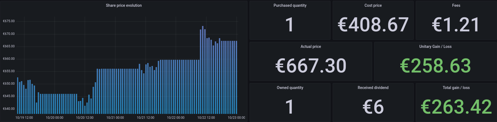

# Stock Share Monitoring

Small app written in Python to monitor the stock shares you own. It uses InfluxDB as TSDB and Yfinance to scrape the price in realtime.  



## Using SuiviBourse

Please visit the [documentation's website](https://suivibourse-docs.netlify.app) !

## Getting Started

There are mutiple ways to run the app but **Docker Compose** is the easiest way to begin !

Note: Docker Compose launches a full environnement with a pre-configured Prometheus and Grafana 

### 1. Install Requirements
* Docker (>19.03.0)
* Docker-Compose 

### 2. Modify config
Edit the `config.yaml` file located in `docker-compose` folder. Complete the file with the provided example or visit the [chapter 3](https://suivibourse-docs.netlify.app/config) of the documentation to know more about writing config file. 

*Example Config:* 
```yaml
---
shares:
- name: Apple
  symbol: AAPL
  purchase:
    quantity: 1
    fee: 2
    cost_price: 119.98
  estate:
    quantity: 2
    received_dividend: 2.85
```

### 3. Run the stack
Run the following command in the `docker-compose` folder :

```bash
docker-compose up -d
```

### 4. Visit Grafana
Connect to Grafana (`http://localhost:3000`) with the following credentials:
* login:  `admin`
* password: `admin`
    
and go to dashboard **Stock share monitoring**

*NB:* please wait ~10m to see all the cells getting filled
