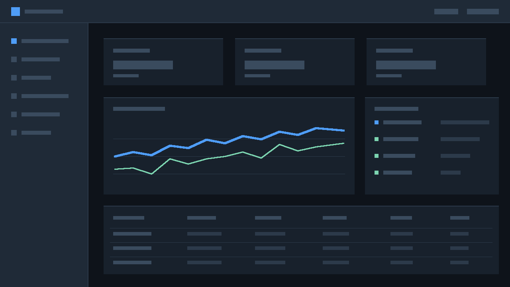

# SuiviBourse

Track your portfolio: your events in, your figures out, in one container.



## Run it

```bash
docker run -d \
  --name suivi-bourse \
  --restart unless-stopped \
  -v suivi-bourse:/data \
  -p 8080:8080 \
  ghcr.io/pbrissaud/suivi-bourse:5
```

Then open [http://localhost:8080](http://localhost:8080).

Your portfolio lives in the `suivi-bourse` volume — that is the one argument to
keep if you adapt the command.

## Documentation

Everything else — importing your events, reading your figures, the settings,
running without Docker — is on
[the documentation website](https://pbrissaud.github.io/suivi-bourse/docs/).

## Contributing

Bug reports and pull requests are welcome; please read
[CONTRIBUTING.md](CONTRIBUTING.md) first.

## Licence

[MIT](LICENSE)
