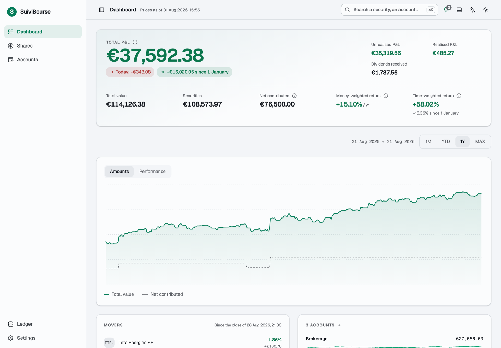
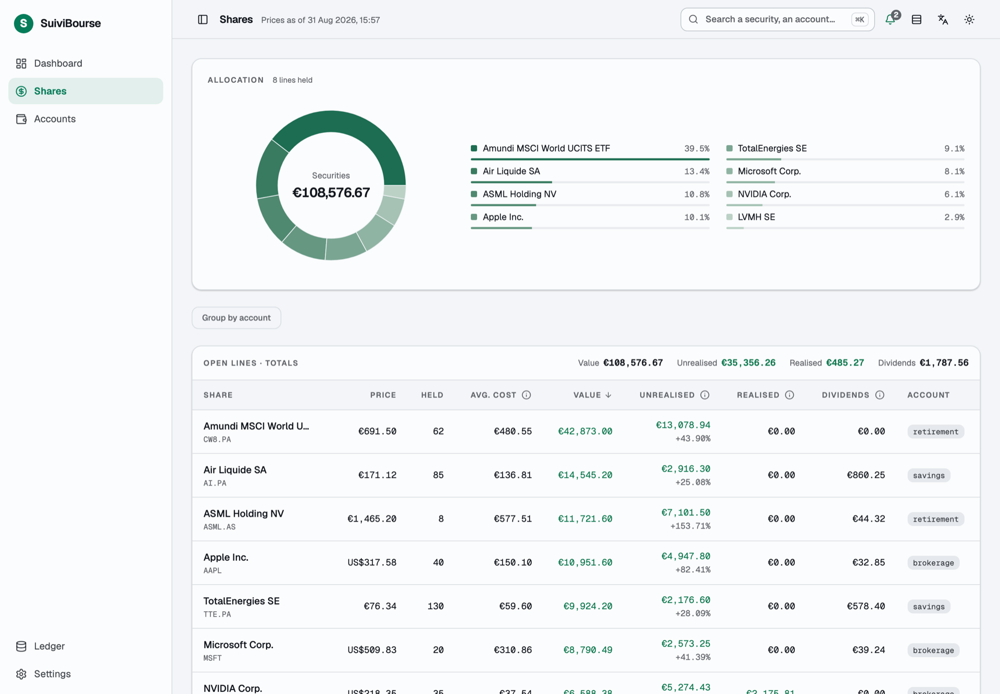
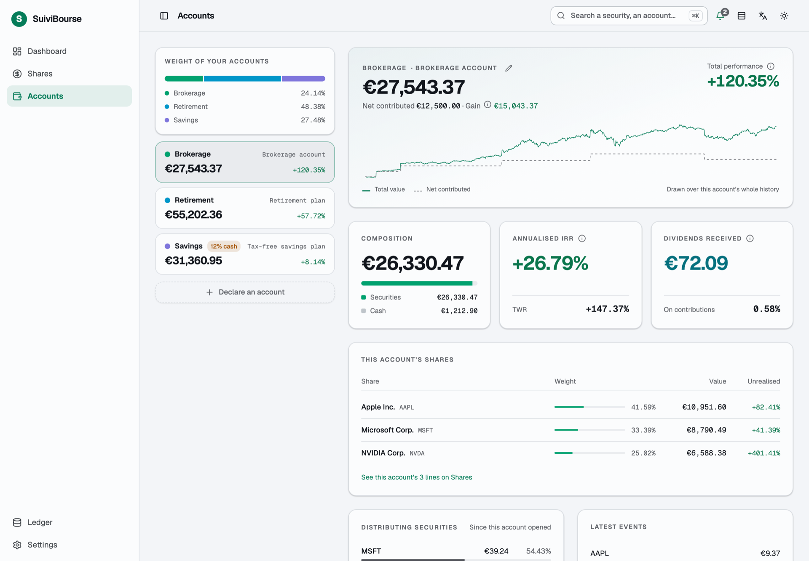
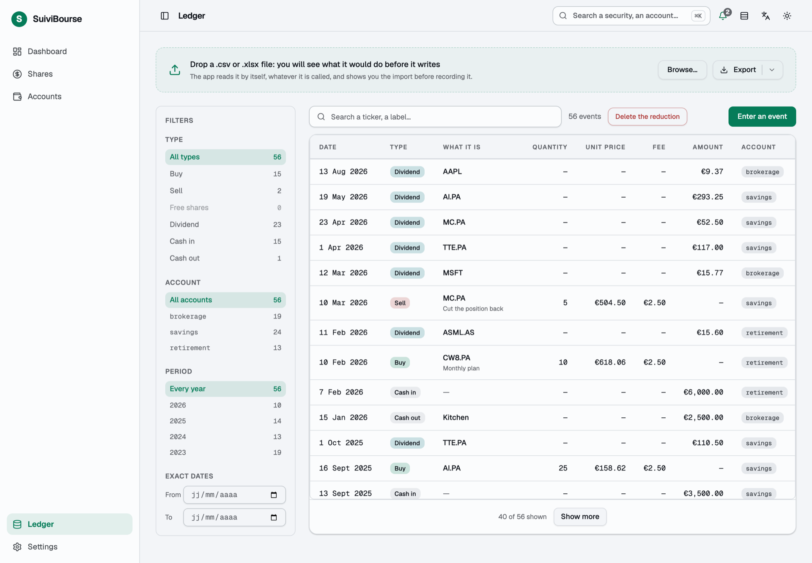

# SuiviBourse

Track your portfolio: your events in, your figures out, in one container.

<picture>
  <source media="(prefers-color-scheme: dark)" srcset="website/static/img/app-dashboard-dark.png">
  
</picture>

<sub>Every figure on this page comes from a portfolio that does not exist. The
prices behind it are real.</sub>

## Run it

```bash
docker run -d \
  --name suivi-bourse \
  --restart unless-stopped \
  -v suivi-bourse:/data \
  -p 8080:8080 \
  ghcr.io/pbrissaud/suivi-bourse:5
```

Then open [http://localhost:8080](http://localhost:8080). The app asks one
question — the currency you want your figures in — and from there you either
type your first event or hand it a `.csv`/`.xlsx` of your history.

Your portfolio lives in the `suivi-bourse` volume — that is the one argument to
keep if you adapt the command. There is no second mount: a file you import is
read once and never kept.

**Nothing is published.** SuiviBourse has no accounts and no login: whoever
reaches the socket reaches the whole app. Keep it on a private network, or put
your own reverse proxy or VPN in front of it — see [SECURITY.md](SECURITY.md).

## What it does

A portfolio is a dated ledger of what you bought, sold, received and paid in,
and only that. Everything else — your positions, the prices, the return series —
is derived from it and rebuilt whenever the ledger moves.

<details>
<summary><b>The other three pages</b></summary>

**Shares** — every open line, what it cost, what it is worth, and how the whole
is allocated.

<picture>
  <source media="(prefers-color-scheme: dark)" srcset="website/static/img/app-shares-dark.png">
  
</picture>

**Accounts** — each account weighed against the others, with its own curve, its
composition, its annualised return and the dividends it paid.

<picture>
  <source media="(prefers-color-scheme: dark)" srcset="website/static/img/app-accounts-dark.png">
  
</picture>

**Ledger** — the events themselves: filter them, correct one, delete a whole
import, export what you are looking at.

<picture>
  <source media="(prefers-color-scheme: dark)" srcset="website/static/img/app-ledger-dark.png">
  
</picture>

</details>

## Documentation

Everything else — importing your events, reading your figures, the settings,
running without Docker, coming from v4 — is on
[the documentation website](https://pbrissaud.github.io/suivi-bourse/docs/v5/).

## Contributing

Bug reports and pull requests are welcome; please read
[CONTRIBUTING.md](CONTRIBUTING.md) first. A vulnerability goes through
[SECURITY.md](SECURITY.md) instead, privately.

## Licence

[MIT](LICENSE)
